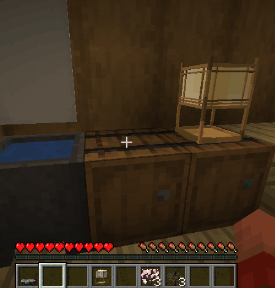

# ポン丸MOD

Java学習とFabric MOD開発の練習として作成している
和風アイテムを追加するMinecraft MODです。

行燈などの装飾ブロックや、おにぎりなどの食べ物を追加します。
開発ログはQiitaにまとめています。

---

## Development log
https://qiita.com/ROROROMP/items/aa0b8904cd1f6b50f833

---

## Environment

* Minecraft 1.21.1
* Fabric Loader
* Fabric API

